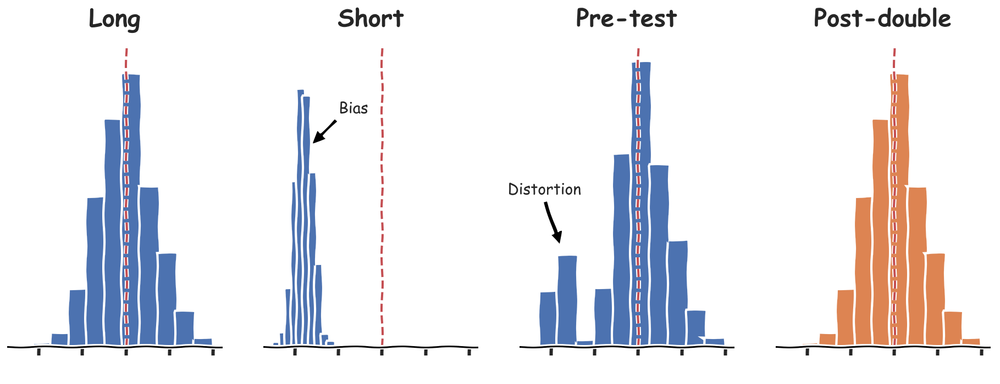
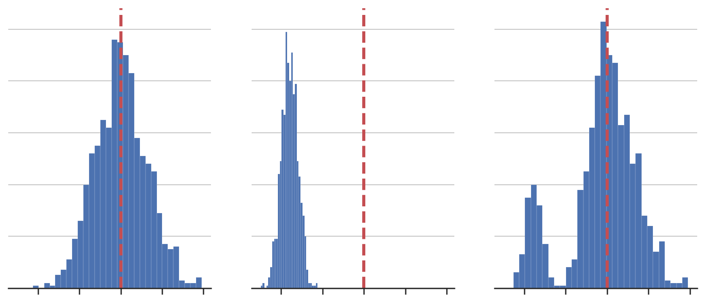
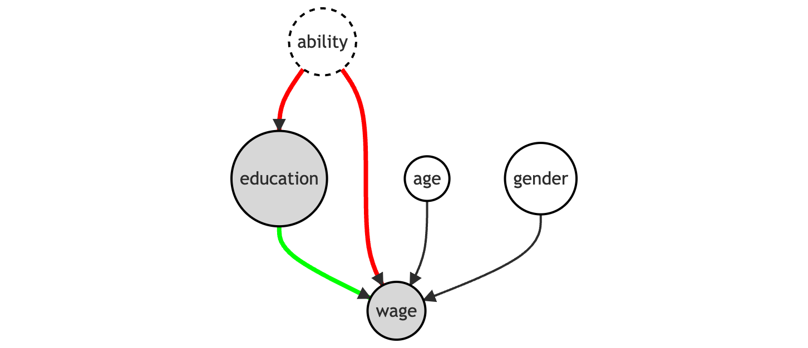
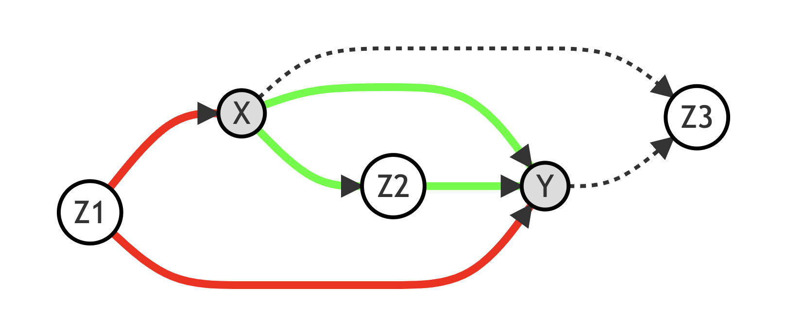

# Medium Blog Posts

Hi all! 👋 

In this repository, I collect drafts and published Jupyter Notebooks for blog posts on [my website](https://matteocourthoud.github.io/) and [Medium](https://medium.com/@matteo.courthoud). I write to learn and help others.

If you find mistakes or you have suggestions for new posts, let me know! Hug 🤗 

## Posts

- [Double Debiased Machine Learning (part 2)](https://towardsdatascience.com/bf990720a0b2)

  *How to remove regularization bias using post-double selection*

- [Double Debiased Machine Learning (part 1)](https://towardsdatascience.com/eb767a59975b)

  *Causal inference, machine learning, and regularization bias*

- [Understanding Omitted Variable Bias](https://towardsdatascience.com/344ac1477699)

  *A step-by-step guide to the most pervasive type of bias*

- [Understanding The Frisch-Waugh-Lovell Theorem](https://towardsdatascience.com/59f801eb3299)

  *A step-by-step guide to one of the most powerful theorems in causal inference*

- [Goodbye Scatterplot, Welcome Binned Scatterplot](https://towardsdatascience.com/a928f67413e4)

	*How to visualize and do inference on conditional means*

- [Experiments, Peeking, and Optimal Stopping](https://towardsdatascience.com/954506cec665)

	*How to run valid experiments with smaller sample sizes with the Sequential Probability Ratio Test*

- [DAGs and Control Variables](https://towardsdatascience.com/b63dc69e3d8c)

  *How to select control variables for causal inference using Directed Acyclic Graphs*

