# Medium Blog Posts

Hi all! 👋 

In this repository, I collect drafts and published Jupyter Notebooks for blog posts on [my website](https://matteocourthoud.github.io/) and [Medium](https://medium.com/@matteo.courthoud). I write to learn and help others.

If you find mistakes or you have suggestions for new posts, let me know! Hug 🤗 

## Posts

- [From Causal Trees to Forests](https://towardsdatascience.com/43c4536f1481)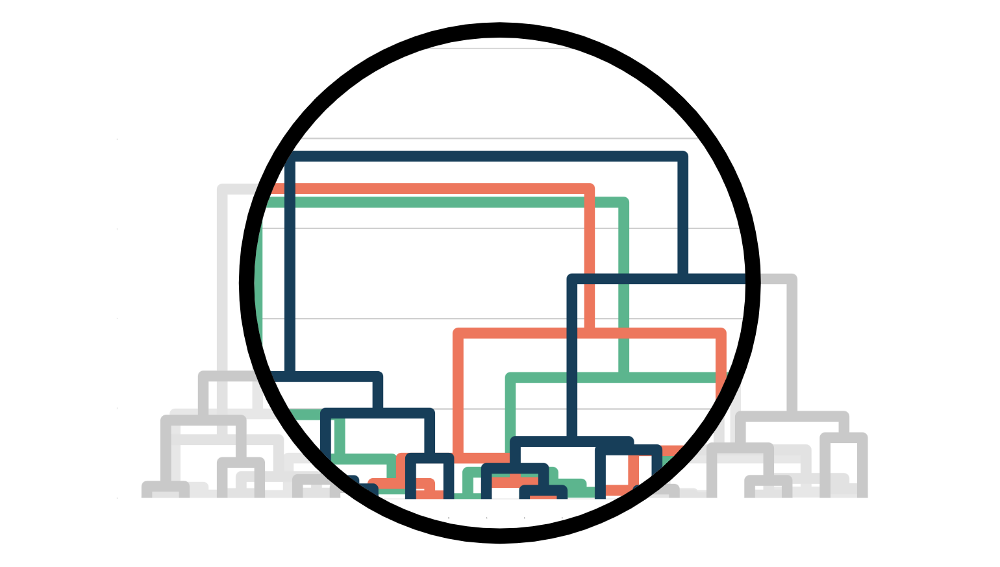

  *How to use random forests to do policy targeting*

- [Understanding Causal Trees](https://towardsdatascience.com/ed4097dab27a)

  *How to use regression trees to estimate heterogeneous treatment effects*

- [Bayesian AB Testing](https://towardsdatascience.com/ed45cc8c964d)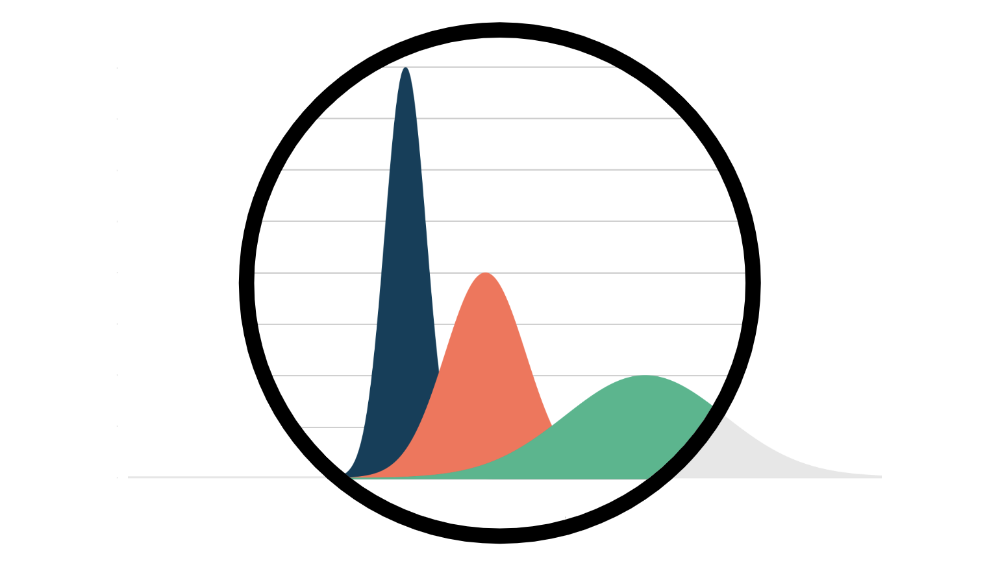

  *Using and choosing priors in randomized experiments*

- [Experiments on Returns on Investment](https://towardsdatascience.com/34a1953c5f16)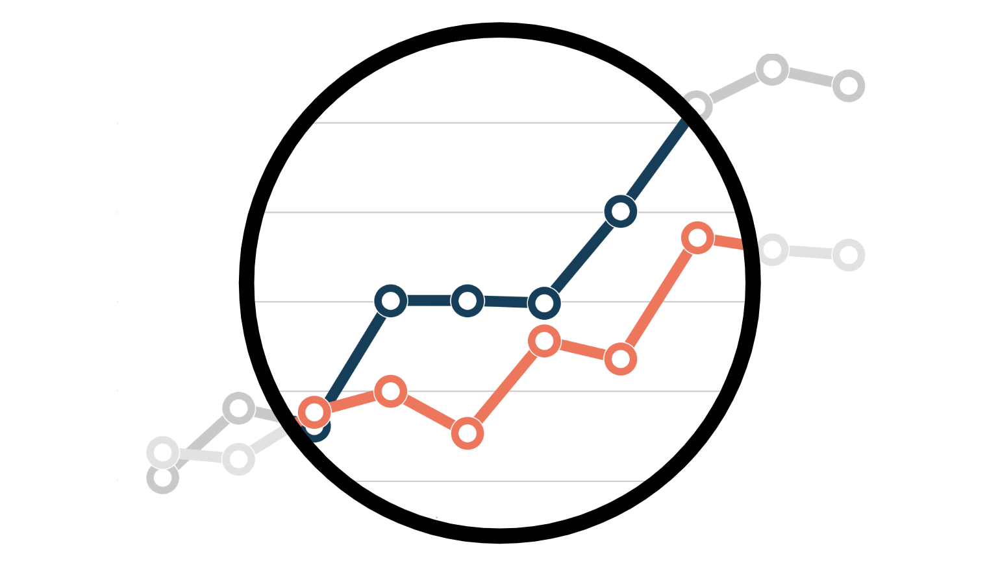

  *An introduction to the delta method for inference on ratio metrics*

- [Mean vs Median Causal Effect](https://towardsdatascience.com/37057a6c54c9)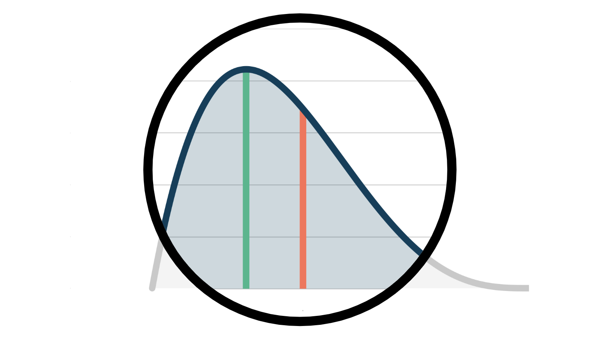

  *An introduction to quantile regression in A/B tests*

- [A/B Tests, Privacy, and Online Regression](https://towardsdatascience.com/b07ab46aa782)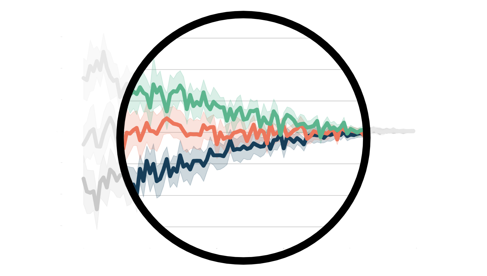

  *How to run experiments without storing individual-level data*

- [Outliers, Leverage, Residuals, and Influential Observations](https://towardsdatascience.com/df3065a0388e)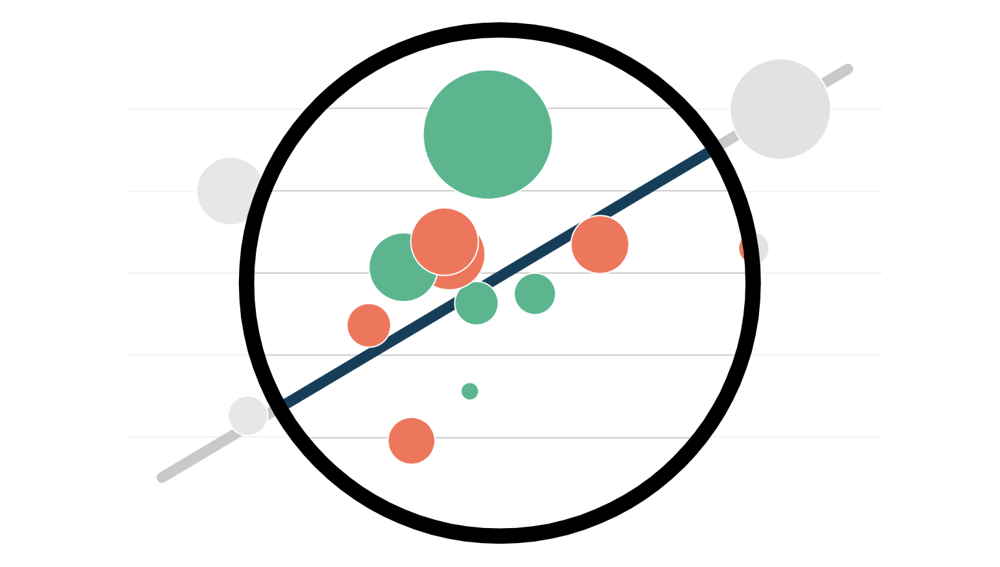

  *What makes an observation “unusual”?*

- [The Bayesian Bootstrap](https://towardsdatascience.com/6ca4a1d45148)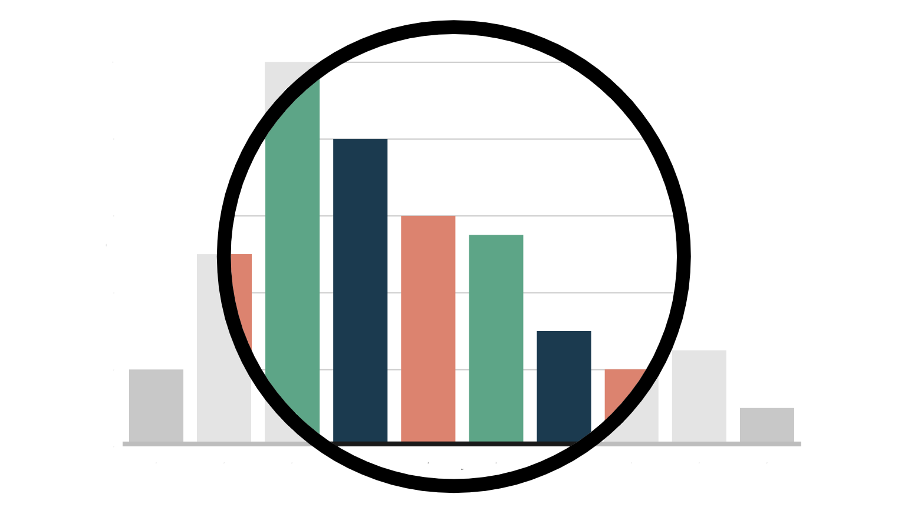

  *A short guide to a simple and powerful extension of the bootstrap*

- [Understanding Synthetic Control Methods](https://towardsdatascience.com/8a9c1e340832)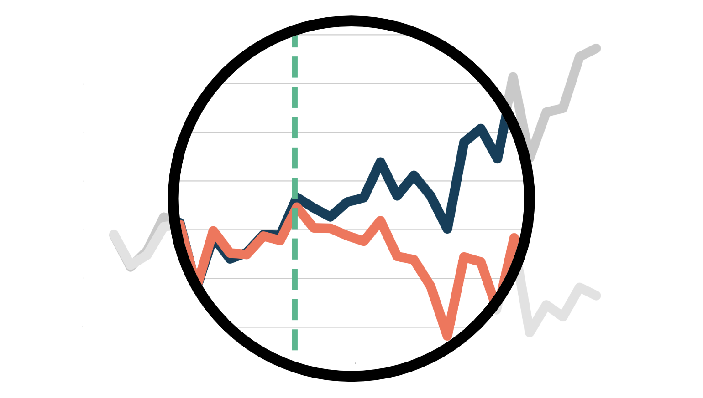

  *A detailed guide to one of the most popular causal inference techniques in the industry*

- [Understanding AIPW, the Doubly-Robust Estimator](https://towardsdatascience.com/ed4097dab27a)

  *A guide to the estimation of conditional average treatment effects (CATE) under model misspecification*

- [Understanding Meta Learners](https://towardsdatascience.com/8a9c1e340832)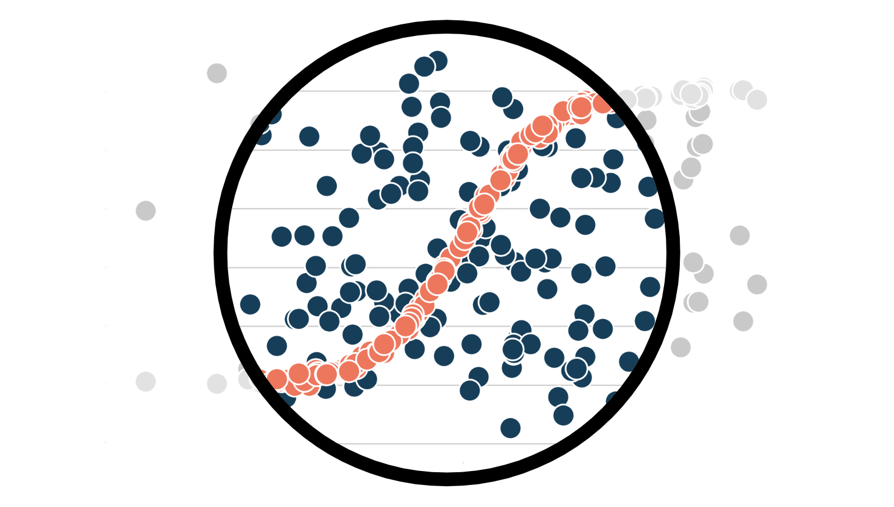

  *How to use machine learning to estimate heterogeneous treatment effects*

- [Matching, Weighting, or Regression?](https://towardsdatascience.com/99bf5cffa0d9)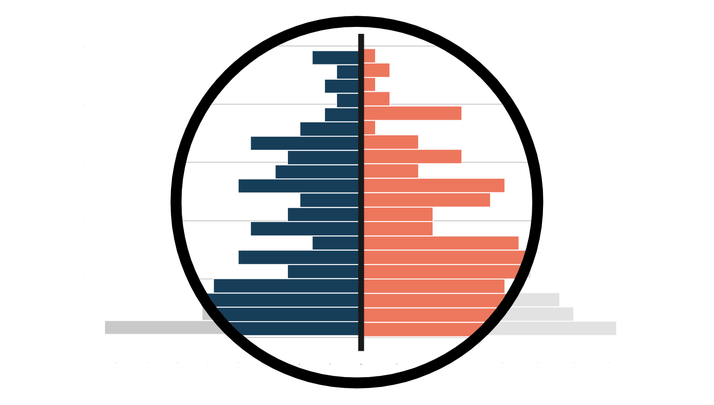

  *Understanding and comparing different methods for conditional causal inference analysis*

- [Understanding CUPED](https://towardsdatascience.com/a822523641af)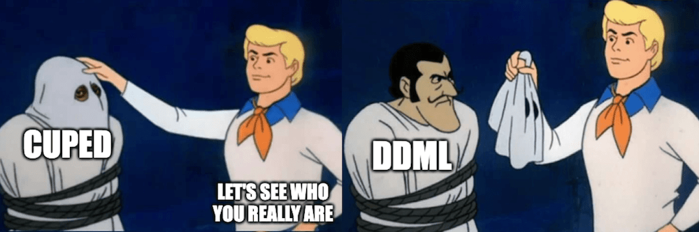

  *An in-depth guide to the state-of-the-art* *variance reduction technique for A/B tests*

- [How to Compare Two or More Distributions](https://towardsdatascience.com/9b06ee4d30bf)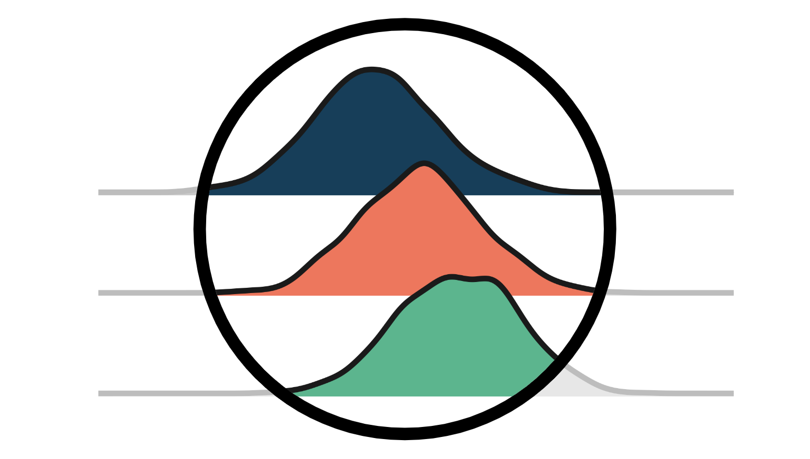

  *A complete guide to comparing distributions, from visualization to statistical tests*

- [Understanding Contamination Bias](https://towardsdatascience.com/58b63d25d2ef)

  *Problems and solutions of linear regression with multiple mutually exclusive treatments*

- [Double Debiased Machine Learning (part 2)](https://towardsdatascience.com/bf990720a0b2)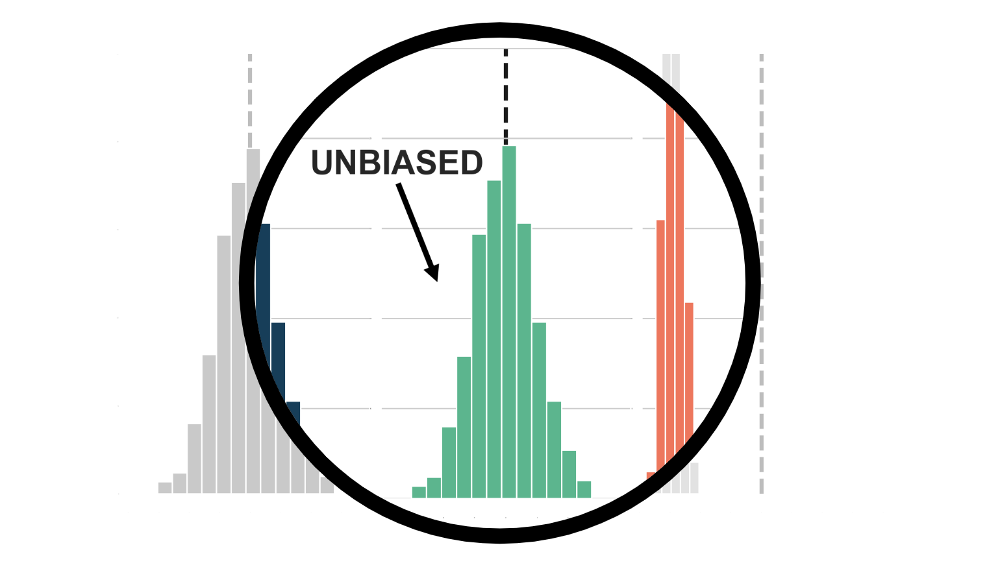

  *How to remove regularization bias using post-double selection*

- [Double Debiased Machine Learning (part 1)](https://towardsdatascience.com/eb767a59975b)

  *Causal inference, machine learning, and regularization bias*

- [Understanding Omitted Variable Bias](https://towardsdatascience.com/344ac1477699)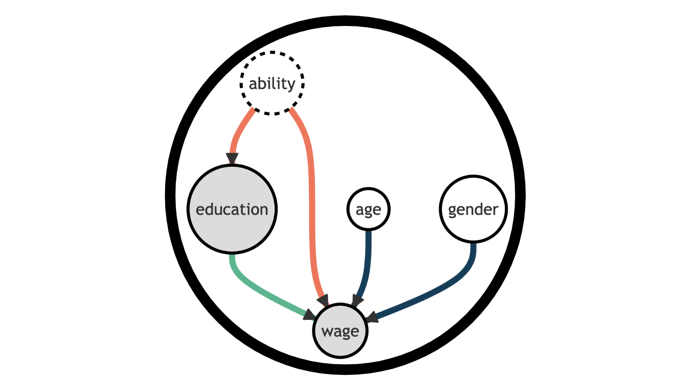

  *A step-by-step guide to the most pervasive type of bias*

- [Understanding The Frisch-Waugh-Lovell Theorem](https://towardsdatascience.com/59f801eb3299)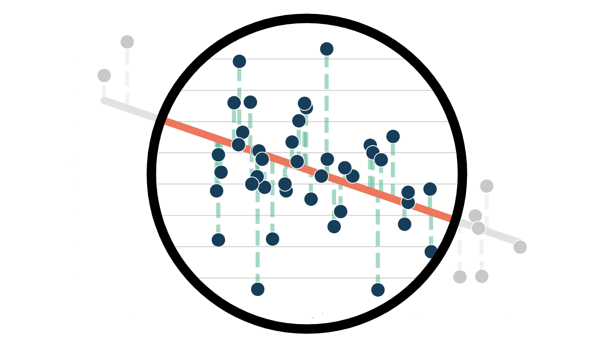

  *A step-by-step guide to one of the most powerful theorems in causal inference*

- [Goodbye Scatterplot, Welcome Binned Scatterplot](https://towardsdatascience.com/a928f67413e4)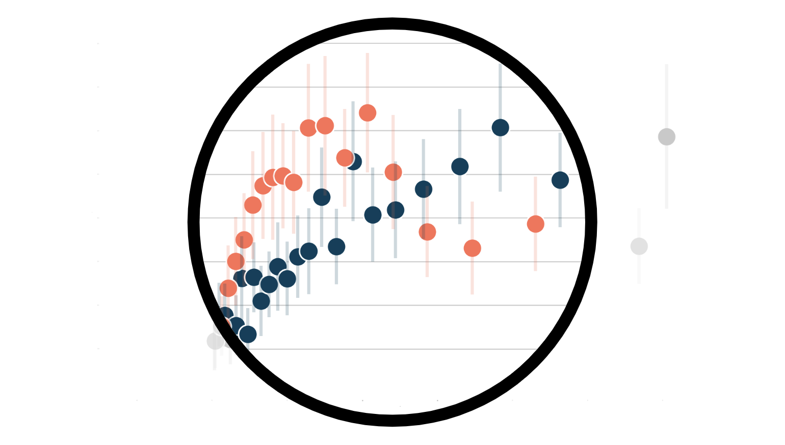

  *How to visualize and do inference on conditional means*

- [Experiments, Peeking, and Optimal Stopping](https://towardsdatascience.com/954506cec665)

  *How to run valid experiments with smaller sample sizes with the Sequential Probability Ratio Test*

- [DAGs and Control Variables](https://towardsdatascience.com/b63dc69e3d8c)

  *How to select control variables for causal inference using Directed Acyclic Graphs*

