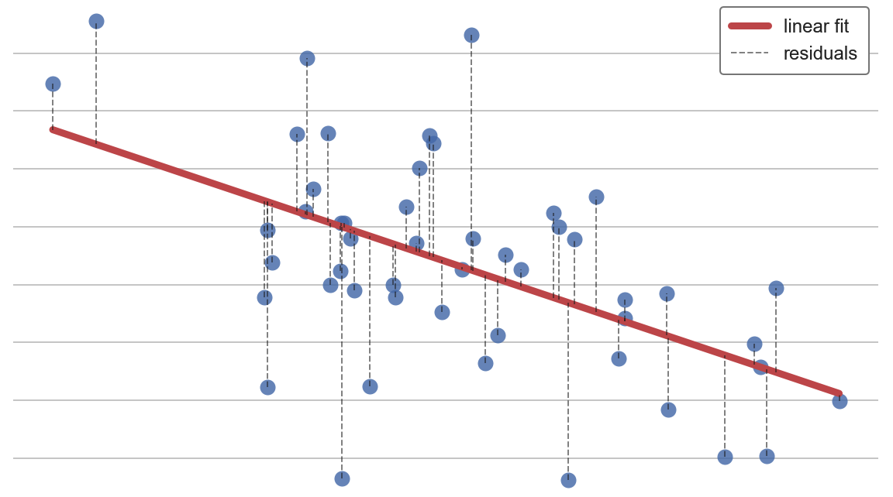
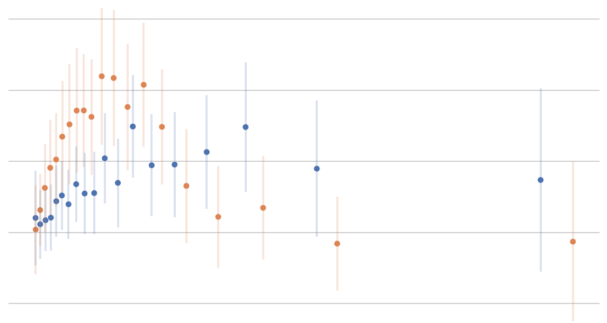

# My Blog Posts

Hi all! 👋 

In this repository, I collect drafts and published Jupyter Notebooks for blog posts on [my website](https://matteocourthoud.github.io/) and [Medium](https://medium.com/@matteo.courthoud). I write to learn and help others.

If you have suggestions for new posts, let me know! Hug 🤗 

## Posts

[The FWL Theorem, Or How To Make All Regressions Intuitive](https://medium.com/p/59f801eb3299)

[Goodbye Scatterplot, Welcome Binned Scatterplot](https://medium.com/a928f67413e4)

[Experiments, Peeking, and Optimal Stopping](https://medium.com/p/954506cec665)

